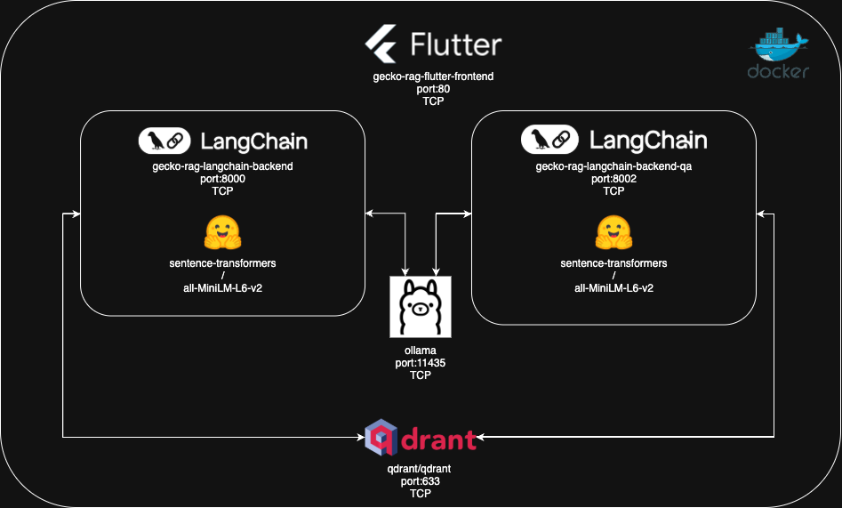

# Frontend y Testing - Documentación Técnica

## Frontend Flutter Web

### Descripción General

El frontend del sistema Gecko RAG está desarrollado en Flutter y compilado para web, proporcionando una interfaz de usuario moderna y responsiva para interactuar con los servicios de RAG. La aplicación se sirve a través de Nginx en un contenedor Docker.

### Integración en la Arquitectura



Como se observa en el diagrama de arquitectura, el frontend Flutter:
- **Se ejecuta en el puerto 80** dentro del contenedor (mapeado al 8081 externamente)
- **Se comunica vía HTTP/TCP** con ambos servicios backend
- **Actúa como punto de entrada** para las interacciones del usuario
- **Utiliza Nginx** como servidor web para servir los archivos estáticos

### Arquitectura del Frontend

#### Estructura de Directorios

```
flutter-web/
├── build/web/           # Aplicación Flutter compilada
├── Dockerfile          # Configuración del contenedor
├── default.conf        # Configuración de Nginx
└── [otros archivos Flutter]
```

#### Configuración de Nginx

```nginx
# default.conf
server {
    listen 80;
    server_name localhost;
    
    location / {
        root /usr/share/nginx/html;
        index index.html index.htm;
        try_files $uri $uri/ /index.html;
    }
    
    error_page 500 502 503 504 /50x.html;
    location = /50x.html {
        root /usr/share/nginx/html;
    }
}
```

**Características de la Configuración**:
- **Single Page Application**: Redirige todas las rutas a index.html
- **Archivos Estáticos**: Sirve archivos compilados de Flutter
- **Puerto 80**: Puerto estándar HTTP interno
- **Fallback**: Manejo de rutas de Flutter

#### Dockerfile del Frontend

```dockerfile
FROM nginx:alpine
COPY build/web /usr/share/nginx/html
COPY default.conf /etc/nginx/conf.d/default.conf
EXPOSE 80
CMD ["nginx", "-g", "daemon off;"]
```

**Proceso de Construcción**:
1. **Base Alpine**: Imagen ligera de Nginx
2. **Copia de Archivos**: Aplicación Flutter compilada
3. **Configuración**: Archivo de configuración personalizado
4. **Exposición**: Puerto 80 para tráfico HTTP

### Aplicación Flutter Compilada

#### Archivos Principales

```
build/web/
├── index.html              # Punto de entrada principal
├── main.dart.js           # Código Dart compilado a JavaScript
├── flutter.js             # Runtime de Flutter para web
├── flutter_service_worker.js # Service worker para PWA
├── assets/                # Recursos de la aplicación
├── canvaskit/            # Motor de renderizado
└── icons/                # Iconos de la aplicación
```

#### Características de la Aplicación

**Progressive Web App (PWA)**:
- **Service Worker**: Caching y funcionalidad offline
- **Manifest**: Configuración para instalación como app
- **Iconos**: Múltiples tamaños para diferentes dispositivos

**Renderizado**:
- **CanvasKit**: Motor de renderizado de alta performance
- **Responsive Design**: Adaptable a diferentes tamaños de pantalla
- **Optimización Web**: Compilación optimizada para navegadores

#### Integración con Backend

La aplicación Flutter se comunica con los servicios backend a través de HTTP:

```dart
// Ejemplo de comunicación con backend
final response = await http.post(
  Uri.parse('http://localhost:8000/ask'),
  headers: {'Content-Type': 'application/json'},
  body: jsonEncode({'question': userQuestion}),
);
```

**Endpoints Utilizados**:
- **Backend Principal**: `http://localhost:8000/ask`
- **Backend QA**: `http://localhost:8002/ask`

### Configuración CORS

Los servicios backend están configurados para permitir peticiones desde el frontend:

```python
app.add_middleware(
    CORSMiddleware,
    allow_origins=["*"],  # Permite peticiones desde cualquier origen
    allow_credentials=True,
    allow_methods=["*"],
    allow_headers=["*"]
)
```

**Consideraciones de Seguridad**:
- **Desarrollo**: Configuración permisiva para facilitar desarrollo
- **Producción**: Recomendado restringir orígenes específicos
- **Headers**: Permite todos los headers necesarios para Flutter

## Sistema de Testing

### Ubicación y Estructura

```
test/
└── questions.bash    # Script de pruebas con curl
```

### Script de Pruebas (questions.bash)

#### Contenido del Script

```bash
#!/bin/bash

# Pregunta básica
curl -X POST http://3.148.176.196:8000/ask \
  -H "Content-Type: application/json" \
  -d '{"question": "Que es intestino?"}'

# Pregunta técnica sobre Método de Elementos Finitos
curl -X POST http://3.148.176.196:8000/ask \
  -H "Content-Type: application/json" \
  -d '{"question": "Que me puedes decir del Método de los Elementos Finitos ?"}'

# Pregunta compleja sobre ecuaciones diferenciales
curl -X POST http://3.148.176.196:8000/ask \
  -H "Content-Type: application/json" \
  -d '{"question": "que ecuaciones diferenciales están entre las más complejas de resolver teórica o numéricamente??"}'

# Comentario sobre tipos de búsqueda
# values for type of search 'stuff', 'map_reduce', 'refine', 'map_rerank'
```

#### Tipos de Consultas de Prueba

**1. Consulta Básica**:
```json
{"question": "Que es intestino?"}
```
- **Propósito**: Verificar funcionamiento básico
- **Expectativa**: Respuesta general o indicación de fuera de dominio

**2. Consulta Técnica Específica**:
```json
{"question": "Que me puedes decir del Método de los Elementos Finitos ?"}
```
- **Propósito**: Probar conocimiento especializado
- **Expectativa**: Respuesta detallada sobre elementos finitos
- **Sección Esperada**: `aprendiendo_sobre_el_metodo_de_los_elementos_finitos.txt`

**3. Consulta Compleja**:
```json
{"question": "que ecuaciones diferenciales están entre las más complejas de resolver teórica o numéricamente??"}
```
- **Propósito**: Evaluar capacidad de análisis complejo
- **Expectativa**: Respuesta sobre ecuaciones diferenciales complejas
- **Sección Esperada**: `mtds.txt` o documentos relacionados

### Ejecución de Pruebas

#### Preparación del Entorno

```bash
# Hacer ejecutable el script
chmod +x test/questions.bash

# Verificar que los servicios estén ejecutándose
docker-compose ps
```

#### Ejecución Manual

```bash
# Ejecutar script completo
./test/questions.bash

# Ejecutar consulta individual
curl -X POST http://localhost:8000/ask \
  -H "Content-Type: application/json" \
  -d '{"question": "Tu pregunta aquí"}'
```

#### Verificación de Respuestas

**Estructura de Respuesta Esperada**:
```json
{
  "answer": "Respuesta generada por el sistema RAG..."
}
```

**Indicadores de Funcionamiento Correcto**:
- **Código HTTP 200**: Petición procesada exitosamente
- **Respuesta JSON**: Formato correcto de respuesta
- **Contenido Relevante**: Respuesta relacionada con la pregunta
- **Tiempo de Respuesta**: Menos de 30 segundos típicamente

### Testing Avanzado

#### Pruebas de Rendimiento

```bash
# Múltiples peticiones concurrentes
for i in {1..10}; do
  curl -X POST http://localhost:8000/ask \
    -H "Content-Type: application/json" \
    -d '{"question": "Test question '$i'"}' &
done
wait
```

#### Pruebas de Ambos Backends

```bash
# Backend principal (puerto 8000)
curl -X POST http://localhost:8000/ask \
  -H "Content-Type: application/json" \
  -d '{"question": "Método de elementos finitos"}'

# Backend QA (puerto 8002)
curl -X POST http://localhost:8002/ask \
  -H "Content-Type: application/json" \
  -d '{"question": "Método de elementos finitos"}'
```

#### Comparación de Respuestas

**Backend Principal**:
- Análisis de consulta más sofisticado
- Filtrado por secciones específicas
- Respuestas más precisas y contextuales

**Backend QA**:
- Procesamiento más directo
- Búsqueda en todo el corpus
- Respuestas más rápidas pero menos específicas

### Métricas de Testing

#### Tiempo de Respuesta

```bash
# Medir tiempo de respuesta
time curl -X POST http://localhost:8000/ask \
  -H "Content-Type: application/json" \
  -d '{"question": "Test question"}'
```

**Tiempos Esperados**:
- **Backend Principal**: 5-15 segundos
- **Backend QA**: 2-8 segundos
- **Variación**: Depende de complejidad de consulta y hardware

#### Calidad de Respuestas

**Criterios de Evaluación**:
1. **Relevancia**: ¿La respuesta está relacionada con la pregunta?
2. **Precisión**: ¿La información es correcta?
3. **Completitud**: ¿La respuesta es suficientemente detallada?
4. **Coherencia**: ¿La respuesta es lógica y bien estructurada?

### Automatización de Testing

#### Script de Testing Automatizado

```bash
#!/bin/bash
# test_automation.bash

BACKEND_URL="http://localhost:8000"
QA_URL="http://localhost:8002"

# Array de preguntas de prueba
questions=(
  "Que es el método de elementos finitos?"
  "Como se resuelven ecuaciones diferenciales?"
  "Que son los métodos numéricos?"
)

echo "Iniciando pruebas automatizadas..."

for question in "${questions[@]}"; do
  echo "Probando: $question"
  
  # Probar backend principal
  response=$(curl -s -X POST $BACKEND_URL/ask \
    -H "Content-Type: application/json" \
    -d "{\"question\": \"$question\"}")
  
  if [[ $? -eq 0 ]]; then
    echo "✓ Backend principal: OK"
  else
    echo "✗ Backend principal: FALLO"
  fi
  
  # Probar backend QA
  response=$(curl -s -X POST $QA_URL/ask \
    -H "Content-Type: application/json" \
    -d "{\"question\": \"$question\"}")
  
  if [[ $? -eq 0 ]]; then
    echo "✓ Backend QA: OK"
  else
    echo "✗ Backend QA: FALLO"
  fi
  
  echo "---"
done

echo "Pruebas completadas."
```

### Debugging y Troubleshooting

#### Problemas Comunes del Frontend

**1. Frontend No Carga**:
```bash
# Verificar estado del contenedor
docker-compose ps flutter-frontend

# Verificar logs
docker-compose logs flutter-frontend

# Verificar puerto
curl http://localhost:8081
```

**2. Error de CORS**:
- Verificar configuración CORS en backends
- Comprobar que los orígenes estén permitidos
- Revisar headers de las peticiones

**3. Peticiones Fallan**:
```bash
# Verificar conectividad desde frontend
docker-compose exec flutter-frontend ping langchain-backend

# Verificar variables de entorno
docker-compose exec langchain-backend env | grep HOST
```

#### Debugging de APIs

**Herramientas Útiles**:
```bash
# Verificar endpoints disponibles
curl http://localhost:8000/docs  # FastAPI docs (si están habilitadas)

# Probar conectividad básica
curl http://localhost:8000/health  # Si existe endpoint de health

# Verificar formato de respuesta
curl -v http://localhost:8000/ask \
  -H "Content-Type: application/json" \
  -d '{"question": "test"}'
```

### Mejoras Futuras para Testing

#### Testing Automatizado Avanzado

1. **Unit Tests**: Pruebas unitarias para componentes individuales
2. **Integration Tests**: Pruebas de integración entre servicios
3. **Load Testing**: Pruebas de carga con herramientas como Apache Bench
4. **UI Testing**: Pruebas automatizadas de la interfaz Flutter

#### Monitoreo Continuo

1. **Health Checks**: Endpoints de salud para cada servicio
2. **Métricas**: Recolección de métricas de rendimiento
3. **Alertas**: Notificaciones automáticas de fallos
4. **Dashboards**: Visualización de estado del sistema

#### Validación de Calidad

1. **Evaluación Automática**: Scripts para evaluar calidad de respuestas
2. **Benchmarks**: Comparación con respuestas esperadas
3. **Regression Testing**: Verificación de que cambios no degraden calidad
4. **A/B Testing**: Comparación entre diferentes configuraciones
