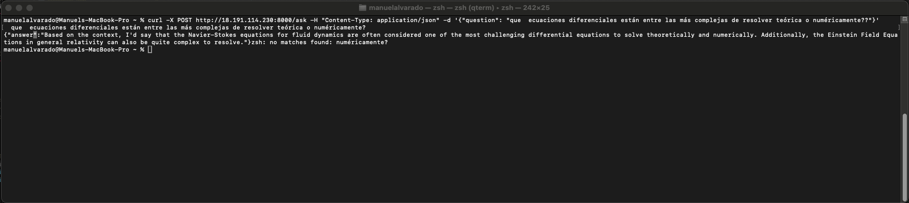
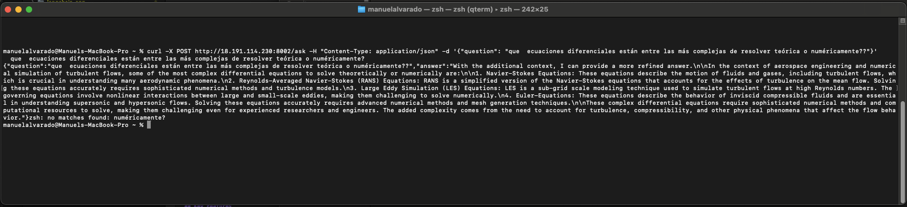

# 07 - Uso de APIs y Ejemplos de Interacción

## Descripción General

Este documento proporciona una guía completa para interactuar con las dos APIs del sistema Gecko RAG. Incluye ejemplos prácticos, comparaciones de funcionalidad y casos de uso recomendados para cada endpoint.

## APIs Disponibles

El sistema Gecko RAG ofrece dos endpoints distintos para diferentes casos de uso:

### 1. API RAG Avanzada (Puerto 8000)
- **Endpoint**: `http://localhost:8000/ask`
- **Características**: Análisis inteligente de consultas con LangGraph
- **Uso recomendado**: Consultas técnicas específicas y dirigidas

### 2. API QA Simplificada (Puerto 8002)
- **Endpoint**: `http://localhost:8002/ask`
- **Características**: Respuesta directa sin análisis de consulta
- **Uso recomendado**: Preguntas generales y exploratorias

## API RAG Avanzada (Puerto 8000)

### Características Técnicas

La API avanzada utiliza LangGraph para realizar un análisis inteligente de las consultas y enrutarlas a las secciones de documentos más apropiadas mediante filtrado por `source`.

**Pipeline de Procesamiento**:
1. **Análisis de Consulta**: Determina la sección de documento más relevante
2. **Filtrado por Source**: Busca solo en documentos que coincidan con el `source` identificado
3. **Generación de Respuesta**: Produce respuestas focalizadas y precisas

**Sistema de Filtrado por Source**:

La API avanzada está diseñada para realizar filtrado utilizando el campo `source` que hace referencia al nombre del archivo del corpus. Durante el proceso de ingesta de datos, los nombres de archivos se normalizan usando el siguiente proceso:

```python
document['archivo'] = re.sub(r'[()\s]', lambda m: '_' if m.group(0) == ' ' else '', 
    unicodedata.normalize('NFKD', document['archivo'])
    .encode('ascii', 'ignore')
    .decode('utf-8')
)
```

**Proceso de Normalización**:
1. **Normalización Unicode**: Convierte caracteres especiales a su forma base
2. **Codificación ASCII**: Elimina caracteres no-ASCII
3. **Reemplazo de Espacios**: Los espacios se convierten en guiones bajos (`_`)
4. **Eliminación de Paréntesis**: Se eliminan los paréntesis `()` del nombre

**Ejemplos de Transformación de Nombres**:
- `"Aprendiendo sobre el método de los elementos finitos.txt"` → `"aprendiendo_sobre_el_metodo_de_los_elementos_finitos.txt"`
- `"Manual Técnico (Versión 2).pdf"` → `"Manual_Tecnico_Version_2.pdf"`
- `"Guía de Métodos Numéricos.docx"` → `"Guia_de_Metodos_Numericos.docx"`

**Archivos de Corpus Disponibles** (nombres normalizados):
- `aprendiendo_sobre_el_metodo_de_los_elementos_finitos.txt`
- `mtds.txt`
- `ame1co.txt`
- `ame1cr.txt`
- `ame1jn.txt`

**Nota**: Esta lista de archivos puede ser actualizada manualmente en el código de la API RAG Avanzada para incluir corpus especializados adicionales según las necesidades del proyecto. Los nombres deben corresponder exactamente con los valores del campo `source` almacenados en los metadatos de Qdrant.

**Importante**: Para consultas que requieran filtrado específico, se recomienda usar los nombres de archivo normalizados (con guiones bajos y sin caracteres especiales) en lugar de los nombres originales con espacios y acentos.

### Formato de Solicitud y Respuesta

**Solicitud**:
```json
{
  "question": "tu pregunta aquí"
}
```

**Respuesta**:
```json
{
  "answer": "respuesta generada basada en recuperación inteligente de documentos"
}
```

### Ejemplos de Uso

#### Consulta Básica
```bash
curl -X POST http://localhost:8000/ask \
  -H "Content-Type: application/json" \
  -d '{"question": "Que es intestino?"}'
```

#### Consulta Técnica sobre Elementos Finitos
```bash
curl -X POST http://localhost:8000/ask \
  -H "Content-Type: application/json" \
  -d '{"question": "Que me puedes decir del Método de los Elementos Finitos?"}'
```

#### Consulta Matemática Compleja
```bash
curl -X POST http://localhost:8000/ask \
  -H "Content-Type: application/json" \
  -d '{"question": "que ecuaciones diferenciales están entre las más complejas de resolver teórica o numéricamente?"}'
```

#### Consulta Específica por Archivo (Recomendado)
Para obtener mejores resultados con el filtrado por `source`, incluye el nombre del archivo normalizado en tu consulta:

```bash
# Consulta específica sobre elementos finitos
curl -X POST http://localhost:8000/ask \
  -H "Content-Type: application/json" \
  -d '{"question": "Explícame sobre elementos finitos del archivo aprendiendo_sobre_el_metodo_de_los_elementos_finitos.txt"}'

# Consulta sobre métodos específicos
curl -X POST http://localhost:8000/ask \
  -H "Content-Type: application/json" \
  -d '{"question": "Información sobre métodos del archivo mtds.txt"}'
```

**Recomendación**: Al hacer consultas específicas, incluye el nombre del archivo normalizado (por ejemplo, `aprendiendo_sobre_el_metodo_de_los_elementos_finitos.txt`) en lugar del nombre original con espacios y acentos (por ejemplo, `"Aprendiendo sobre el método de los elementos finitos.txt"`). Esto ayuda al sistema LangGraph a identificar correctamente el archivo de destino para el filtrado.

### Ejemplo de Respuesta Real

La siguiente captura de pantalla muestra una interacción típica con la API RAG Avanzada (puerto 8000), demostrando el comando curl y la respuesta para una pregunta matemática compleja:



Como se muestra en el ejemplo, la API RAG Avanzada proporciona respuestas focalizadas sobre ecuaciones diferenciales complejas, mencionando específicamente las ecuaciones de Navier-Stokes y las Ecuaciones de Campo de Einstein como algunas de las más desafiantes de resolver teórica y numéricamente.

## API QA Simplificada (Puerto 8002)

### Características Técnicas

La API QA utiliza un enfoque directo de recuperación y respuesta sin análisis previo de la consulta, proporcionando respuestas más amplias y detalladas.

**Pipeline de Procesamiento**:
1. **Búsqueda por Similitud**: Busca en todos los documentos disponibles
2. **Deduplicación**: Elimina documentos duplicados por ID
3. **Generación de Respuesta**: Produce respuestas comprehensivas con contexto amplio

### Formato de Solicitud y Respuesta

**Solicitud**:
```json
{
  "question": "tu pregunta aquí"
}
```

**Respuesta**:
```json
{
  "question": "pregunta original",
  "answer": "respuesta generada"
}
```

### Ejemplos de Uso

#### Consulta Matemática Compleja
```bash
curl -X POST http://localhost:8002/ask \
  -H "Content-Type: application/json" \
  -d '{"question": "que ecuaciones diferenciales están entre las más complejas de resolver teórica o numéricamente?"}'
```

### Ejemplo de Respuesta Real

La siguiente captura de pantalla muestra una interacción típica con la API QA Simplificada (puerto 8002), demostrando tanto el comando curl como la respuesta comprehensiva:



La API QA proporciona respuestas más comprehensivas que incluyen:
- Explicaciones detalladas de conceptos matemáticos complejos
- Múltiples ejemplos y metodologías
- Información contextual de varias fuentes de documentos
- Detalles técnicos relevantes al dominio de la consulta

## Comparación de APIs

### Tabla Comparativa

| Característica | API RAG Avanzada (8000) | API QA Simplificada (8002) |
|----------------|-------------------------|---------------------------|
| **Análisis de Consulta** | ✅ Enrutamiento inteligente con LangGraph | ❌ Búsqueda directa por similitud |
| **Filtrado de Documentos** | ✅ Filtrado específico por campo `source` (nombre de archivo normalizado) | ❌ Busca en todos los documentos |
| **Normalización de Nombres** | ✅ Utiliza nombres de archivo normalizados (sin espacios, sin acentos) | ❌ No aplica filtrado por nombre |
| **Calidad de Respuesta** | Mayor precisión para temas específicos | Cobertura más amplia con más contexto |
| **Caso de Uso** | Consultas técnicas dirigidas a archivos específicos | Preguntas generales con detalle |
| **Pipeline de Procesamiento** | Multi-paso: Análisis → Filtrado por Source → Generación | Un paso: Recuperación → Generación |

### Cuándo Usar Cada API

#### API RAG Avanzada (Puerto 8000)
**Usar cuando**:
- Necesites respuestas precisas y focalizadas
- La consulta sea sobre un tema técnico específico
- Quieras aprovechar el enrutamiento inteligente de documentos
- La velocidad sea menos importante que la precisión

**Ejemplos de consultas ideales**:
- Preguntas específicas sobre métodos de elementos finitos
- Consultas técnicas sobre metodologías específicas
- Preguntas que requieren información de una sección particular

#### API QA Simplificada (Puerto 8002)
**Usar cuando**:
- Necesites respuestas comprehensivas y detalladas
- La consulta sea exploratoria o general
- Quieras información de múltiples fuentes
- La velocidad de respuesta sea prioritaria

**Ejemplos de consultas ideales**:
- Preguntas abiertas sobre conceptos amplios
- Consultas que requieren contexto de múltiples documentos
- Preguntas exploratorias sobre temas complejos

## Scripts de Prueba

### Archivo de Pruebas Automatizadas

El proyecto incluye scripts de prueba en `test/questions.bash` con consultas de ejemplo para ambas APIs:

```bash
# Probar API RAG Avanzada (Puerto 8000)
curl -X POST http://localhost:8000/ask \
  -H "Content-Type: application/json" \
  -d '{"question": "que ecuaciones diferenciales están entre las más complejas de resolver teórica o numéricamente?"}'

# Probar API QA Simplificada (Puerto 8002)
curl -X POST http://localhost:8002/ask \
  -H "Content-Type: application/json" \
  -d '{"question": "que ecuaciones diferenciales están entre las más complejas de resolver teórica o numéricamente?"}'
```

### Comparación de Respuestas

Para evaluar las diferencias entre ambas APIs, puedes ejecutar la misma consulta en ambos endpoints y comparar:

1. **Tiempo de respuesta**
2. **Nivel de detalle**
3. **Precisión de la información**
4. **Cobertura del tema**

## Manejo de Errores

### Formato de Error Estándar

Ambas APIs devuelven errores en el siguiente formato:

```json
{
  "error": "descripción del error aquí"
}
```

### Errores Comunes

#### Errores de Formato
- **JSON inválido**: Verificar sintaxis del JSON en la solicitud
- **Campos faltantes**: Asegurar que el campo `question` esté presente

#### Errores de Servicio
- **Servicio no disponible**: Verificar que Ollama y Qdrant estén ejecutándose
- **Timeout**: Aumentar el tiempo de espera para consultas complejas
- **Conectividad**: Verificar la red entre contenedores Docker

#### Ejemplos de Troubleshooting

```bash
# Verificar estado de servicios
docker-compose ps

# Verificar logs de servicios
docker-compose logs langchain-backend
docker-compose logs langchain-backend-qa

# Probar conectividad básica
curl -X GET http://localhost:8000/
curl -X GET http://localhost:8002/
```

## Optimización y Rendimiento

### Factores que Afectan el Rendimiento

#### API RAG Avanzada (8000)
- **Análisis de consulta**: Tiempo adicional para LangGraph
- **Filtrado específico**: Búsqueda más eficiente en subconjuntos
- **Complejidad de la consulta**: Consultas más complejas toman más tiempo

#### API QA Simplificada (8002)
- **Búsqueda amplia**: Busca en toda la base de datos
- **Deduplicación**: Procesamiento adicional para eliminar duplicados
- **Generación de respuesta**: Más contexto puede requerir más tiempo

### Recomendaciones de Optimización

1. **Usar la API apropiada** para cada tipo de consulta
2. **Implementar timeout** adecuado en aplicaciones cliente
3. **Cachear respuestas** frecuentes si es apropiado
4. **Monitorear recursos** del sistema durante uso intensivo

## Integración con Aplicaciones

### Ejemplo de Integración Python

```python
import requests
import json

def consultar_api_avanzada(pregunta):
    url = "http://localhost:8000/ask"
    payload = {"question": pregunta}
    
    try:
        response = requests.post(url, json=payload, timeout=30)
        response.raise_for_status()
        return response.json()
    except requests.exceptions.RequestException as e:
        return {"error": str(e)}

def consultar_api_qa(pregunta):
    url = "http://localhost:8002/ask"
    payload = {"question": pregunta}
    
    try:
        response = requests.post(url, json=payload, timeout=30)
        response.raise_for_status()
        return response.json()
    except requests.exceptions.RequestException as e:
        return {"error": str(e)}

# Ejemplo de uso
pregunta = "¿Qué es el método de elementos finitos?"
respuesta_avanzada = consultar_api_avanzada(pregunta)
respuesta_qa = consultar_api_qa(pregunta)

print("API Avanzada:", respuesta_avanzada)
print("API QA:", respuesta_qa)
```

### Ejemplo de Integración JavaScript

```javascript
async function consultarAPIAvanzada(pregunta) {
    try {
        const response = await fetch('http://localhost:8000/ask', {
            method: 'POST',
            headers: {
                'Content-Type': 'application/json',
            },
            body: JSON.stringify({ question: pregunta })
        });
        
        if (!response.ok) {
            throw new Error(`HTTP error! status: ${response.status}`);
        }
        
        return await response.json();
    } catch (error) {
        return { error: error.message };
    }
}

async function consultarAPIQA(pregunta) {
    try {
        const response = await fetch('http://localhost:8002/ask', {
            method: 'POST',
            headers: {
                'Content-Type': 'application/json',
            },
            body: JSON.stringify({ question: pregunta })
        });
        
        if (!response.ok) {
            throw new Error(`HTTP error! status: ${response.status}`);
        }
        
        return await response.json();
    } catch (error) {
        return { error: error.message };
    }
}

// Ejemplo de uso
const pregunta = "¿Qué es el método de elementos finitos?";
consultarAPIAvanzada(pregunta).then(respuesta => {
    console.log("API Avanzada:", respuesta);
});

consultarAPIQA(pregunta).then(respuesta => {
    console.log("API QA:", respuesta);
});
```

## Métricas y Monitoreo

### Métricas Recomendadas

#### Rendimiento
- **Tiempo de respuesta promedio** por API
- **Throughput** (consultas por minuto)
- **Tasa de error** por endpoint

#### Calidad
- **Relevancia de respuestas** (evaluación manual)
- **Cobertura de consultas** exitosas
- **Satisfacción del usuario** (si aplicable)

### Herramientas de Monitoreo

```bash
# Monitoreo básico con curl y time
time curl -X POST http://localhost:8000/ask \
  -H "Content-Type: application/json" \
  -d '{"question": "test question"}'

# Logs de contenedores
docker-compose logs -f langchain-backend
docker-compose logs -f langchain-backend-qa

# Métricas de recursos
docker stats
```

## Casos de Uso Avanzados

### Procesamiento por Lotes

Para procesar múltiples consultas, considera implementar:

1. **Pool de conexiones** para manejar múltiples solicitudes
2. **Rate limiting** para evitar sobrecarga del sistema
3. **Procesamiento asíncrono** para consultas no críticas

### Integración con Sistemas Externos

Las APIs pueden integrarse con:

- **Chatbots** y asistentes virtuales
- **Sistemas de documentación** interactiva
- **Plataformas de e-learning**
- **Herramientas de investigación** académica

## Troubleshooting Común

### Problemas de Conectividad

```bash
# Verificar que los servicios estén ejecutándose
docker-compose ps

# Verificar conectividad de red
docker network ls
docker network inspect gecko-rag-dev-v1_demo
```

### Problemas de Rendimiento

```bash
# Verificar recursos del sistema
docker stats

# Verificar logs para errores
docker-compose logs --tail=50 langchain-backend
docker-compose logs --tail=50 langchain-backend-qa
```

### Problemas de Respuesta

1. **Respuestas vacías**: Verificar que Qdrant tenga datos cargados
2. **Respuestas lentas**: Considerar usar GPU si está disponible
3. **Errores de timeout**: Aumentar límites de tiempo en cliente

## Conclusiones

Las dos APIs del sistema Gecko RAG ofrecen capacidades complementarias:

- **API RAG Avanzada (8000)**: Ideal para consultas técnicas específicas que requieren precisión
- **API QA Simplificada (8002)**: Perfecta para exploración general y respuestas comprehensivas

La elección entre ambas depende del caso de uso específico, los requisitos de velocidad y el nivel de detalle necesario en las respuestas.

---

**Nota**: Para obtener los mejores resultados, experimenta con ambas APIs usando las mismas consultas para entender sus fortalezas y diferencias en tu contexto específico de uso.
