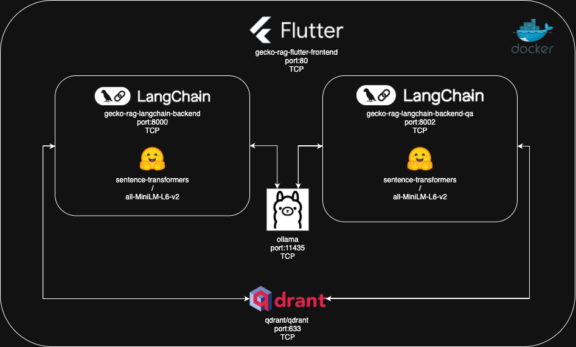

# Documentación Gecko RAG

## Diagrama de Arquitectura del Sistema

El diagrama muestra la arquitectura completa del sistema Gecko RAG con todos los contenedores Docker, sus puertos, protocolos de comunicación y las interacciones entre servicios. Este diagrama es referenciado a lo largo de toda la documentación para facilitar la comprensión de la arquitectura.

## Índice de Documentación

Esta carpeta contiene la documentación completa del sistema Gecko RAG, organizada en módulos temáticos para facilitar la consulta y el mantenimiento.

### Estructura de la Documentación

#### [01 - Resumen General](./01-resumen-general.md)
**Descripción**: Visión general del proyecto, arquitectura y características principales
- Descripción del proyecto y objetivos
- Arquitectura de microservicios
- Componentes principales del sistema
- Tecnologías utilizadas
- Casos de uso y ventajas del sistema

#### [02 - Ingesta de Datos (load.py)](./02-ingesta-datos-load.md)
**Descripción**: Documentación detallada del sistema de ingesta y procesamiento de datos
- Funcionalidad del archivo `load.py`
- Proceso de inicialización de la base de datos vectorial
- Integración con el cliente GECO
- Modelo de embeddings all-MiniLM-L6-v2
- Segmentación y procesamiento de documentos
- Almacenamiento en Qdrant

#### [03 - Cliente GECO](./03-cliente-geco.md)
**Descripción**: Documentación técnica del cliente para la API GECO
- Arquitectura del cliente `gecko_client.py`
- Sistema de autenticación con tokens
- Métodos de consulta de corpus y documentos
- Extracción de contenido textual
- Gestión de metadatos y archivos adjuntos
- Manejo de errores y robustez

#### [04 - Servicios Backend](./04-servicios-backend.md)
**Descripción**: Documentación de los servicios backend de LangChain
- Backend principal con LangGraph (puerto 8000)
- Backend QA simplificado (puerto 8002)
- Pipeline RAG avanzado vs. QA directo
- Configuración de modelos y embeddings
- APIs y endpoints disponibles
- Comparación de funcionalidades

#### [05 - Infraestructura y Despliegue](./05-infraestructura-despliegue.md)
**Descripción**: Documentación de Docker Compose y configuración de infraestructura
- Arquitectura de contenedores
- Configuración multi-hardware (CPU, GPU NVIDIA, GPU AMD)
- Gestión de volúmenes y persistencia de datos
- Redes y comunicación entre servicios
- Comandos de despliegue y troubleshooting
- Optimizaciones para producción

#### [06 - Frontend y Testing](./06-frontend-testing.md)
**Descripción**: Documentación del frontend Flutter y sistema de pruebas
- Aplicación Flutter Web compilada
- Configuración de Nginx
- Integración con servicios backend
- Scripts de testing automatizado
- Métricas de rendimiento y calidad
- Debugging y troubleshooting

#### [07 - Uso de APIs y Ejemplos de Interacción](./07-uso-apis.md)
**Descripción**: Guía completa para interactuar con las APIs del sistema
- API RAG Avanzada (puerto 8000) con LangGraph
- API QA Simplificada (puerto 8002) para respuestas directas
- Ejemplos prácticos con curl y capturas de pantalla
- Comparación detallada de funcionalidades
- Casos de uso recomendados para cada API
- Integración con aplicaciones externas
- Troubleshooting y optimización de rendimiento

## Guía de Navegación

### Para Desarrolladores Nuevos
1. Comenzar con [Resumen General](./01-resumen-general.md) para entender la arquitectura
2. Revisar [Infraestructura y Despliegue](./05-infraestructura-despliegue.md) para configurar el entorno
3. Consultar [Frontend y Testing](./06-frontend-testing.md) para probar el sistema

### Para Administradores de Sistema
1. Enfocarse en [Infraestructura y Despliegue](./05-infraestructura-despliegue.md)
2. Revisar configuraciones de hardware y optimizaciones
3. Consultar secciones de monitoreo y troubleshooting

### Para Científicos de Datos
1. Estudiar [Ingesta de Datos](./02-ingesta-datos-load.md) para entender el procesamiento
2. Revisar [Cliente GECO](./03-cliente-geco.md) para integración de datos
3. Analizar [Servicios Backend](./04-servicios-backend.md) para optimizar el pipeline RAG

### Para Desarrolladores Frontend
1. Consultar [Frontend y Testing](./06-frontend-testing.md)
2. Revisar APIs en [Servicios Backend](./04-servicios-backend.md)
3. Entender la comunicación entre servicios

## Convenciones de Documentación

### Formato
- **Markdown**: Todos los documentos utilizan formato Markdown
- **Secciones**: Estructura jerárquica con headers
- **Código**: Bloques de código con syntax highlighting
- **Enlaces**: Referencias cruzadas entre documentos

### Estructura de Secciones
1. **Descripción General**: Introducción y propósito
2. **Componentes Técnicos**: Detalles de implementación
3. **Configuración**: Parámetros y opciones
4. **Ejemplos**: Casos de uso prácticos
5. **Troubleshooting**: Solución de problemas comunes

### Convenciones de Código
- **Python**: Snippets de código backend
- **YAML**: Configuraciones de Docker Compose
- **Bash**: Scripts y comandos de sistema
- **JSON**: Ejemplos de APIs y respuestas

## Mantenimiento de la Documentación

### Actualización
- **Frecuencia**: Actualizar con cada cambio significativo en el código
- **Versionado**: Mantener sincronización con versiones del software
- **Revisión**: Validar ejemplos y comandos regularmente

### Contribuciones
- **Formato Consistente**: Seguir estructura establecida
- **Ejemplos Funcionales**: Verificar que todos los ejemplos funcionen
- **Referencias Actualizadas**: Mantener enlaces y referencias válidas

### Herramientas Recomendadas
- **Editor Markdown**: VSCode con extensiones de Markdown
- **Validación**: Herramientas de linting para Markdown
- **Previsualización**: Renderizado local para verificar formato

## Recursos Adicionales

### Enlaces Útiles
- **LangChain Documentation**: https://python.langchain.com/
- **Qdrant Documentation**: https://qdrant.tech/documentation/
- **Ollama Documentation**: https://ollama.ai/
- **Flutter Web**: https://flutter.dev/web
- **Docker Compose**: https://docs.docker.com/compose/

### Repositorios Relacionados
- **HuggingFace Transformers**: Para modelos de embeddings
- **FastAPI**: Para desarrollo de APIs
- **LangGraph**: Para orquestación de workflows

### Comunidad y Soporte
- **Issues**: Reportar problemas en el repositorio del proyecto
- **Discusiones**: Foros de las tecnologías utilizadas
- **Actualizaciones**: Seguir releases de dependencias principales

---

**Nota**: Esta documentación está en español para facilitar el uso por parte del equipo de desarrollo. Para contribuciones en inglés, considerar crear versiones traducidas de los documentos principales.
